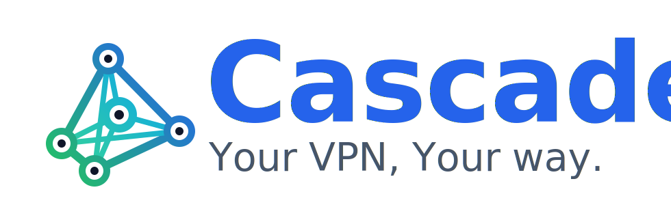

<p align="center">
  
</p>

<h1 align="center">Cascade</h1>

<p align="center">
  <strong>Платформа управления роутером WireGuard / AmneziaWG с веб-интерфейсом</strong>
</p>

<p align="center">
  <a href="https://github.com/JohnnyVBut/cascade/actions/workflows/docker-publish.yml">
    
  </a>
  <a href="LICENSE">
    
  </a>
  
  
</p>

<p align="center">
  <a href="README.md">🇬🇧 English</a>
</p>

---

## ✨ Возможности

| Модуль | Описание |
|--------|----------|
| 🔌 **Интерфейсы** | Несколько туннельных интерфейсов WireGuard / AmneziaWG |
| 👥 **Пиры** | Клиентские и S2S-пиры (site-to-site) с поддержкой QR-кодов |
| 🌐 **Маршрутизация** | Статические маршруты, PBR (Policy-Based Routing), просмотр таблиц ядра |
| 🔀 **NAT** | Outbound MASQUERADE / SNAT с поддержкой алиасов |
| 🛡️ **Файрвол** | Правила фильтрации (ACCEPT / DROP / REJECT) + PBR через шлюз |
| 📋 **Алиасы** | Типы: host, network, ipset, group, port, port-group |
| 📡 **Шлюзы** | Live-мониторинг ping + HTTP/S, группы шлюзов, автоматический failover |
| 🎛️ **Шаблоны AWG2** | Шаблоны параметров обфускации AmneziaWG 2.0 со встроенным генератором |
| 🔒 **TLS** | Let's Encrypt через acme.sh (shortlived-сертификат для bare IP или домен) |
| 🎭 **Decoy-сайт** | Caddy раздаёт фейковый стриминговый сайт на `/`; панель управления скрыта за секретным путём |

## 🎯 Почему Cascade?

- ✅ **Go-бинарник** — один статический бинарник, без Node.js, без npm, без зависимостей
- ✅ **Несколько интерфейсов** — управление несколькими WireGuard/AWG интерфейсами из одного UI
- ✅ **Полный AmneziaWG 2.0** — параметры S3, S4, I5, диапазонная обфускация H, 7 CPS-профилей + browser fingerprint
- ✅ **Policy-Based Routing** — маршрутизация трафика по источнику через разные шлюзы
- ✅ **Мониторинг шлюзов** — ICMP ping + HTTP/S-пробы, автоматический fallback при отказе
- ✅ **HTTPS по умолчанию** — Caddy + acme.sh, работает с bare IP через shortlived-сертификаты Let's Encrypt
- ✅ **Защита admin-панели** — путь к панели скрыт; посетители видят фейковый стриминговый сайт

## 📋 Требования

- Ubuntu 22.04 или 24.04 (другие дистрибутивы: ручная установка)
- Root-доступ
- Публичный IP-адрес или доменное имя
- Открытые порты: `443/tcp` (HTTPS), `51820+/udp` (WireGuard)

---

## 🚀 Быстрая установка

### Userspace-режим — рекомендуется

Работает на **любом VPS** без кастомного ядра. Перезагрузка не нужна, дедлоков нет.

```bash
git clone https://github.com/JohnnyVBut/cascade.git
cd cascade
sudo bash deploy/setup.sh --yes
```

> `--yes` выбирает все значения по умолчанию: **userspace-режим**, автоопределение публичного IP, случайный секретный путь.

### Режим kernel-модуля

Максимальная производительность, но kernel-модуль AmneziaWG имеет **[известные проблемы с дедлоком](https://github.com/amnezia-vpn/amneziawg-linux-kernel-module/issues/146)**,
которые могут заморозить операции с туннелем. Рекомендуется только если нужна максимальная пропускная
способность и вы готовы к периодическим перезапускам интерфейсов.

```bash
git clone https://github.com/JohnnyVBut/cascade.git
cd cascade
# Интерактивная установка — выберите [2] Kernel module на шаге 2
sudo bash deploy/setup.sh
```

### Переключение режима на работающей системе

```bash
sudo bash deploy/switch-mode.sh --userspace   # → amneziawg-go (стабильно)
sudo bash deploy/switch-mode.sh --kernel      # → kernel-модуль (быстро)
```

Скрипт сам выгружает/устанавливает kernel-модуль, обновляет blacklist и перезапускает контейнер.

---

## 🚀 Варианты деплоя

### Вариант А — Только роутер (для продвинутых)

Запускается только контейнер Cascade. Веб-интерфейс доступен **только на localhost** — без публичного доступа, без TLS.
Вопросы сетевой безопасности, аутентификации и контроля доступа решаете сами.

```bash
git clone https://github.com/JohnnyVBut/cascade.git
cd cascade
./build-go.sh
docker compose -f docker-compose.go.yml up -d
# UI доступен на http://127.0.0.1:8888/
```

Используйте, если у вас уже есть reverse proxy, файрвол или доступ только через VPN.
Пошаговое руководство: [docs/DEPLOY.md](docs/DEPLOY.md)

### Вариант Б — Полный стек (рекомендуется)

Одна команда разворачивает всё: AmneziaWG, TLS-сертификат, Caddy reverse proxy
с decoy-сайтом и скрытым путём к панели управления. Роутер никогда не открывается напрямую в интернет.

```bash
git clone https://github.com/JohnnyVBut/cascade.git
cd cascade
sudo bash deploy/setup.sh
```

| Шаг | Что происходит |
|-----|----------------|
| 0 | 1 ГБ swap (защита от OOM при сборке) |
| 1 | Обновление ядра до HWE 6.x (только Ubuntu 22.04) — перезагрузка, затем повтор |
| 2 | **Режим AmneziaWG** — выбор Userspace (рекомендуется) или Kernel-модуль |
| 3 | Установка Docker CE |
| 4 | sysctl: `ip_forward`, UDP-буферы |
| 5 | Сборка Docker-образа Cascade |
| 6 | Интерактивный сбор конфигурации (IP, секретный путь, email) |
| 7 | Запуск Cascade (только localhost) |
| 8 | Выпуск TLS-сертификата через acme.sh (Let's Encrypt) |
| 9 | Запуск Caddy (HTTPS + decoy-сайт + скрытый путь к панели) |

В конце вы получите:
```
Admin URL: https://ВАШ_IP/<секретный-путь>/
```

Откройте в браузере, создайте первого администратора — готово.

> **Повторный запуск безопасен:** `setup.sh` идемпотентен — можно запускать повторно после перезагрузки или обновления.
> При повторном запуске шаг 2 спрашивает `Change run mode? [y/N]` — нажмите `y` для смены режима.

> **Тестирование TLS без rate limits:** используйте `--staging` для выпуска недоверенного сертификата от
> [staging CA Let's Encrypt](https://letsencrypt.org/docs/staging-environment/). Браузер покажет предупреждение — это ожидаемо.
> Для перехода на production удалите `ACME_STAGING=1` из `deploy/.env` и перезапустите `setup.sh`.
> ```bash
> sudo bash deploy/setup.sh --staging        # staging CA (браузер показывает предупреждение — норма)
> sudo bash deploy/setup.sh --yes --staging  # неинтерактивно + staging
> ```

---

## ⚙️ Режимы работы AWG

| | Userspace (`amneziawg-go`) | Kernel-модуль |
|---|---|---|
| Производительность | ~70% от ядра | Максимальная |
| Стабильность | ✅ Стабильно | ⚠️ Известные дедлоки |
| Нужен kernel-модуль | ❌ Нет | ✅ Да |
| Работает на любом VPS | ✅ Да | Зависит от ядра |
| Перезагрузка после установки | ❌ Нет | Иногда |

Текущий режим отображается бэйджем в сайдбаре веб-интерфейса (синий = userspace, зелёный = kernel).

---

## ⚙️ Конфигурация

Настройки собираются интерактивно скриптом `setup.sh` и сохраняются в `deploy/.env`.

| Переменная | По умолчанию | Описание |
|------------|--------------|----------|
| `WG_HOST` | автоопределение | Публичный IP или домен сервера |
| `ADMIN_PATH` | случайный hex | Секретный путь к панели (например `/a1b2c3d4.../`) |
| `CASCADE_PORT` | `8888` | Внутренний порт Cascade (Caddy проксирует на него) |
| `BIND_ADDR` | `127.0.0.1` | Адрес привязки Cascade (используйте `127.0.0.1` за Caddy) |
| `ACME_EMAIL` | опционально | Email для уведомлений Let's Encrypt |
| `ACME_STAGING` | `0` | `1` = использовать staging CA от LE (недоверенный сертификат, без rate limits — для тестирования) |
| `AWG_USERSPACE_IMPL` | `amneziawg-go` | `amneziawg-go` или `kernel` |

Дополнительные настройки (дефолты WireGuard, DNS и т.д.) настраиваются в веб-интерфейсе в разделе **Settings**.

## 🔒 Модель безопасности

- Панель управления доступна только по `https://HOST/<ADMIN_PATH>/` — на `https://HOST/` отображается decoy-сайт
- HTTPS с HTTP/3 (QUIC) через Caddy
- TLS-сертификаты: shortlived (6 дней) для bare IP, стандартные 90-дневные для доменов
- Session cookie: `HttpOnly`, `Secure`, `SameSite=Strict`
- Хеширование паролей bcrypt (cost 12)
- Валидация входных данных на всех API-эндпоинтах

Полная модель угроз: [docs/SECURITY.md](docs/SECURITY.md)

## 🔄 Обновление

```bash
git pull origin feature/go-rewrite
./build-go.sh
docker compose -f docker-compose.go.yml down && docker compose -f docker-compose.go.yml up -d
```

## 📱 Совместимые VPN-клиенты

> ⚠️ **Обычные клиенты WireGuard НЕ работают с интерфейсами AmneziaWG 2.0.**
> Интерфейсы WireGuard 1.0 работают с обычными клиентами без ограничений.

| Платформа | Приложение |
|-----------|------------|
| Android | [Amnezia VPN](https://play.google.com/store/apps/details?id=org.amnezia.vpn) · [AmneziaWG](https://play.google.com/store/apps/details?id=org.amnezia.awg) |
| iOS / macOS | [Amnezia VPN](https://apps.apple.com/app/amneziavpn/id1600529900) · [AmneziaWG](https://apps.apple.com/app/amneziawg/id6478942365) |
| Windows | [Amnezia VPN](https://github.com/amnezia-vpn/amnezia-client/releases) · [AmneziaWG](https://github.com/amnezia-vpn/amneziawg-windows-client/releases) |
| Linux | [amneziawg-tools](https://github.com/amnezia-vpn/amneziawg-tools) · [Amnezia VPN](https://github.com/amnezia-vpn/amnezia-client/releases) |

## 🛠️ Решение проблем

**Проверить состояние контейнеров:**
```bash
docker logs cascade
docker compose -f deploy/caddy/docker-compose.yml logs
```

**Проверить WireGuard-интерфейсы:**
```bash
docker exec cascade awg show
docker exec cascade wg show
```

**Проверить режим работы AWG:**
```bash
docker exec cascade env | grep WG_QUICK
# WG_QUICK_USERSPACE_IMPLEMENTATION=amneziawg-go  → userspace
# (пусто или отсутствует)                         → kernel-модуль
```

**Проверить файрвол / NAT:**
```bash
docker exec cascade iptables-nft -t nat -L -n -v
docker exec cascade ip rule show
```

**Переключить режим AWG:**
```bash
sudo bash deploy/switch-mode.sh --userspace
sudo bash deploy/switch-mode.sh --kernel
```

**Перезапустить setup (например после перезагрузки или обновления сертификата):**
```bash
sudo bash deploy/setup.sh
```

## 🔌 REST API

Cascade предоставляет полноценный REST API — всё, что делает веб-интерфейс, доступно и через API.

```bash
# Аутентификация
curl -c cookies.txt -X POST http://127.0.0.1:8888/api/login \
  -H "Content-Type: application/json" \
  -d '{"username":"admin","password":"yourpassword"}'

# Список интерфейсов
curl -b cookies.txt http://127.0.0.1:8888/api/tunnel-interfaces

# Создать пира
curl -b cookies.txt -X POST http://127.0.0.1:8888/api/tunnel-interfaces/wg10/peers \
  -H "Content-Type: application/json" \
  -d '{"name":"laptop"}'
```

Используйте для автоматизации провизионирования пиров, интеграции с собственными дашбордами или создания кастомных клиентов.

Полная документация: [docs/API.md (RU)](docs/API.md) · [docs/API.en.md (EN)](docs/API.en.md)

## 📖 Документация

- [Руководство по деплою](docs/DEPLOY.md)
- [API Reference (RU)](docs/API.md)
- [API Reference (EN)](docs/API.en.md)
- [Модель безопасности](docs/SECURITY.md)

## 🏗️ Стек технологий

| Уровень | Технология |
|---------|------------|
| Backend | Go 1.23, Fiber v2 |
| Frontend | Vue 2, Tailwind CSS (встроен в бинарник) |
| База данных | SQLite (`modernc.org/sqlite`, без CGO) |
| Reverse proxy | Caddy 2 (HTTP/3 + QUIC) |
| VPN | AmneziaWG 2.0 / WireGuard 1.0 |

## 🙏 Благодарности

- Основано на [wg-easy](https://github.com/wg-easy/wg-easy)
- [AmneziaVPN](https://github.com/amnezia-vpn) за протокол AmneziaWG
- [Vadim-Khristenko/AmneziaWG-Architect](https://github.com/Vadim-Khristenko/AmneziaWG-Architect) — математика и код для генерации параметров обфускации AWG 2.0 (CPS-сигнатуры, H-диапазоны, размеры пакетов Browser Fingerprint)

## 📄 Лицензия

MIT — см. [LICENSE](LICENSE)

---

<p align="center">Сделано с ❤️ для безопасного и приватного доступа в интернет</p>
